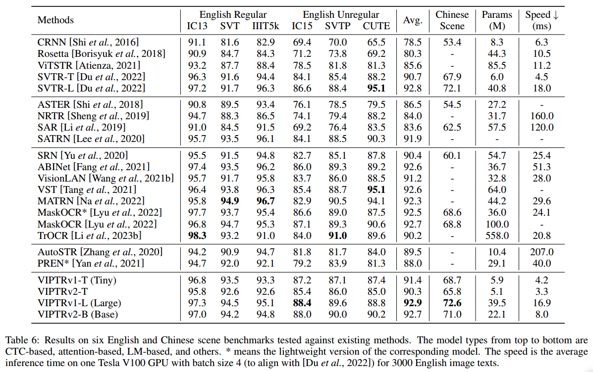

# VIPTR: A Vision Permutable Extractor for Fast and Efficient Scene Text Recognition

| [paper](https://arxiv.org/abs/2401.10110) | [English datasets](https://www.dropbox.com/sh/i39abvnefllx2si/AAAbAYRvxzRp3cIE5HzqUw3ra?dl=0) |[Chinese datasets](https://github.com/fudanvi/benchmarking-chinese-text-recognition#download)| **pretrained model:** [Google driver](https://drive.google.com/drive/folders/1ARBG3GqWjpBqdELvd4I60jLeDBV-UPyt?usp=drive_link) or [Baidu Netdisk (passwd:7npu)](https://pan.baidu.com/s/1N9tSWv2RdZ9peB9w8nr9IA?pwd=7npu) |

## Getting Started

### Dependency

- This work was tested with **PyTorch 1.8.0, CUDA 10.1, python 3.6.13 and Ubuntu 18.04**. 
- requirements : **lmdb, Pillow, torchvision, nltk, natsort, timm, mmcv**

```python
pip install lmdb pillow torchvision nltk natsort timm mmcv
```

### Download lmdb dataset for training and evaluation from following

#### English datasets:

- Synthetic image datasets: [MJSynth (MJ)](http://www.robots.ox.ac.uk/~vgg/data/text/) and [SynthText (ST)](http://www.robots.ox.ac.uk/~vgg/data/scenetext/) and [SynthAdd (password:627x)](https://pan.baidu.com/s/1uV0LtoNmcxbO-0YA7Ch4dg);
- Real image datasets: the union of trainsets **IIIT5K, SVT, IC03, IC13, IC15, COCO-Text, SVTP, CUTE80**; ([baidu](https://pan.baidu.com/s/1sm5ga6gByDZt1HhaMlfz2g?pwd=t5d3)|[google](https://drive.google.com/drive/folders/175cFBt4PGjLEJldL2INJILpTYzVu-AiT?usp=drive_link))
- Validation datasets : the [union](https://www.dropbox.com/sh/i39abvnefllx2si/AAAbAYRvxzRp3cIE5HzqUw3ra?dl=0) of the sets **IC13 (857), SVT, IIIT5k (3000), IC15 (1811), SVTP, and CUTE80**;
- Evaluation datasets : English benchmark datasets, consist of **IIIT5k (3000), SVT, IC13 (857), IC15 (1811), SVTP, and CUTE80**.

#### Chinese datasets:

- Download Chinese training sets, validation sets and evaluation sets from [here](https://github.com/fudanvi/benchmarking-chinese-text-recognition#download) .

## Run benchmark with pretrained model

1. Download pretrained model from [Google driver](https://drive.google.com/drive/folders/1ARBG3GqWjpBqdELvd4I60jLeDBV-UPyt?usp=drive_link) or [Baidu Netdisk (passwd:7npu)](https://pan.baidu.com/s/1N9tSWv2RdZ9peB9w8nr9IA?pwd=7npu) ;

2. Set models path, testsets path and characters  list ;

3. Run **test_benchmark.py** ;

   ```python
   CUDA_VISIBLE_DEVICES=0 python test_benchmark.py --benchmark_all_eval --Transformation TPS19 --FeatureExtraction VIPTRv1T --SequenceModeling None --Prediction CTC --batch_max_length 25 --imgW 96 --output_channel 192
   ```

4. Run **test_chn_benchmark.py**

   ```python
   CUDA_VISIBLE_DEVICES=0 python test_chn_benchmark.py --benchmark_all_eval --Transformation TPS19 --FeatureExtraction VIPTRv1T --SequenceModeling None --Prediction CTC --batch_max_length 64 --imgW 320 --output_channel 192
   ```

## Results on benchmark datasets and comparison with SOTA



## Citation
Please consider citing this work in your publications if it helps your research.
```tex
@article{cheng2024viptr,
  title={VIPTR: A Vision Permutable Extractor for Fast and Efficient Scene Text Recognition},
  author={Cheng, Xianfu and Zhou, Weixiao and Li, Xiang and Chen, Xiaoming and Yang, Jian and Li, Tongliang and Li, Zhoujun},
  journal={arXiv preprint arXiv:2401.10110},
  year={2024}
}
```
## Acknowledgements

- [https://github.com/clovaai/deep-text-recognition-benchmark](https://github.com/clovaai/deep-text-recognition-benchmark)
- [https://github.com/BADBADBADBOY/OCR-TextRecog](https://github.com/BADBADBADBOY/OCR-TextRecog)
- [https://github.com/PaddlePaddle/PaddleOCR](https://github.com/PaddlePaddle/PaddleOCR)
